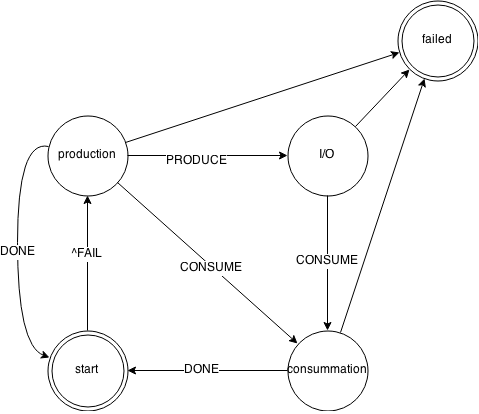

# libknot processing interface

libknot provides generic interfaces for producer/consumer type problems and a way to layer them.
This is heavily leveraged for packet processing and modules, and enables us to build independent
data processors and state machines driving them.

## Building blocks

### layer.h

layer represents a set of functions implementing an interface, with 5 possible callbacks:

```c
	int begin(knot_layer_t *ctx, void *layer_param);
	int reset(knot_layer_t *ctx);
	int finish(knot_layer_t *ctx);
	int consume(knot_layer_t *ctx, knot_pkt_t *pkt);
	int produce(knot_layer_t *ctx, knot_pkt_t *pkt);
	int fail(knot_layer_t *ctx, knot_pkt_t *pkt);
```

An good example of the layer is a [query processor](../../knot/nameserver/process_query.c), where, to give you an example,
an action `consume` represents query-parsing step, `produce` represents answer generator and `fail` an error response generator.

*Note that*, a layer does not assume anything about the driver, but may enforce call order by requiring the context to be in a specific
processing state, see `knot_layer_t.state`, and move the driver to next desired state.
For example, operation `consume` may require the driver to be in `KNOT_STATE_NOOP` and emit:

* `KNOT_STATE_FAIL` if the query is wrong
* `KNOT_STATE_DONE` if the query doesn't warrant an answer
* `KNOT_STATE_PRODUCE` if it found an answer
* `KNOT_STATE_CONSUME` if it requires more queries

*Note that*, I'm using terms "state" and "action" very loosely. State is usually written capitalized and action in lowercase.
They are named similarly as they're usually cause and effect, a `CONSUME` state leads to `consume` reaction, but that's not always the case.

### overlay.h

An overlay is a stack of layers. It provides similar interface as layer, but their actions are chained.
The call order goes from the first to the last for all actions. The state emitted from the previous action is
given as an input to the next action. Example:

```c
	/* Stack layers. */
	knot_overlay_add(overlay, first,  param1);
	knot_overlay_add(overlay, second, param2);
	knot_overlay_add(overlay, third,  param3);
	/* Execute */
	knot_overlay_consume(overlay, pkt);
```
Leads to following execution:

```
	consume(first, pkt)
	  => consume(second, pkt)
	     => consume(third, pkt) => FINAL_STATE
```

*Note that*, an overlay calls `begin` operation as soon as a layer is added into the overlay.

### requestor.h

A requestor is a specific state-machine that in general:

1. prepares a query by passing it to the `produce` overlay action
2. sends the query and receives response
3. consumes the response by passing it to the `consume` overlay action

The query may not always be produced, and the I/O or `consume` action may fail, 
so we get a state machine roughly like this:



The actual requestor also resets the overlay after each failed attempt, so for example a query may be retransmitted,
but you get the idea.

The requestor is used for various tasks from server-initiated connections to forwarding queries, and the system of modules
allows you to extend these operations by adding new layers. A query log might be a good example, as you can monitor not only the
sent queries and received responses, but also the state of the query processor.

## Example

### Query log

Here's an example of a query log, that can track incoming queries and error responses.

```c
/*! Track incoming queries. */
static int dnstrack_query(knot_layer_t *ctx, knot_pkt_t *pkt)
{
	char qname[KNOT_DNAME_MAXLEN];
	knot_dname_to_str(qname, knot_pkt_qname(pkt), sizeof(qname));
	printf("=> query '%s', parser state: %d\n", qname, ctx->state);
	return ctx->state; /* Pass-through */
}

/*! Track error responses. */
static int dnstrack_fail(knot_layer_t *ctx, knot_pkt_t *pkt)
{
	char qname[KNOT_DNAME_MAXLEN];
	knot_dname_to_str(qname, knot_pkt_qname(pkt), sizeof(qname));
	printf("=> answer to '%s', rcode: %d\n",
	       qname, knot_wire_get_rcode(pkt->wire));	
	return ctx->state;
}

/*! Module implementation. */
const knot_layer_api_t *dnstrack_layer(void)
{
	static const knot_layer_api_t api = {
		.consume = &dnstrack_query,
		.fail    = &dnstrack_fail
	};
	return &api;
}

```

Now you can try it in an overlay. The following is a simplified snippet from the UDP query processor,
to showcase the real-world usage:

```c
	/* Prepare overlay */
	struct knot_overlay overlay;
	knot_overlay_init(&overlay, NULL);
	knot_overlay_add(&overlay, process_query_layer(), &param);
	knot_overlay_add(&overlay, dnstrack_layer(), NULL);

	/* Process packet */
	int state = knot_overlay_consume(&overlay, query);
	while (state & (KNOT_STATE_PRODUCE|KNOT_STATE_FAIL)) {
		state = knot_overlay_produce(&overlay, answer);
	}

	/* Finalize. */
	knot_overlay_finish(&overlay);
	knot_overlay_deinit(&overlay);
```

